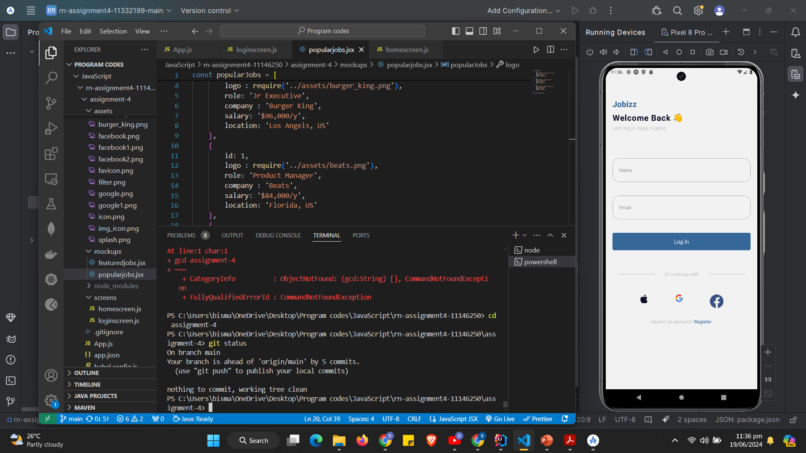
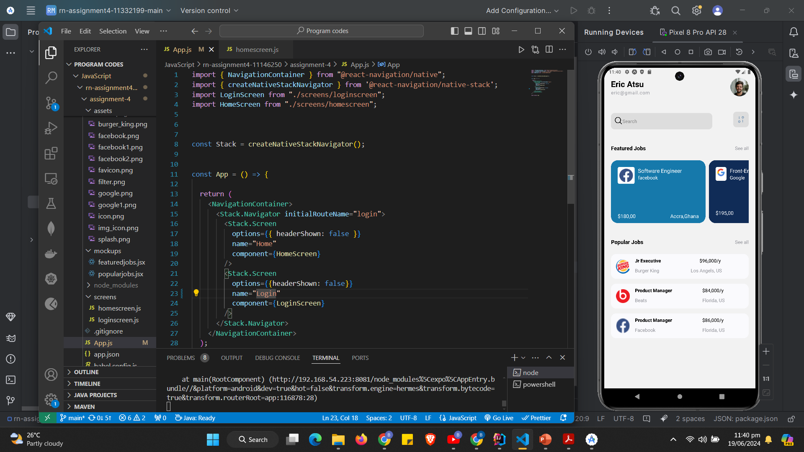

# rn-assignment4-11146250

DCIT202 MOBILE APPLICATION DEVELOPMENT Assignment 4

# rn-assignment4-11146250

Project README
This project consists of two React Native components: Home and LoginIn. Below is a detailed explanation of each component, their functionality, and the components used within them.

Home Component
The Home component represents the main screen of a job listing application. It is structured as follows:

Imports:

React Native components: View, Text, SafeAreaView, ScrollView, StyleSheet, Image, TextInput, FlatList, TouchableOpacity.
Icons from @expo/vector-icons (AntDesign, Entypo).
Custom mockup data imports (FeatureJobsMockUp, PopularjobsMockUp).
Structure:

SafeAreaView and ScrollView are used for safe rendering and scrolling, respectively.
Profile Section:

Displays user information (profilepic.png, name, and email).
Search and Filter:

Contains a search bar (TextInput) and a filter button (Image) for job search functionalities.
Featured Jobs Section:

Displays a list of featured jobs using FlatList.
Each job item is rendered as a TouchableOpacity with details such as job role, company, salary, and location.
Popular Jobs Section:

Similar to featured jobs but displays popular jobs from PopularjobsMockUp.
Also utilizes FlatList and TouchableOpacity for each job item.
Styling:

Uses StyleSheet.create for consistent and styled UI components throughout the screen.
LoginIn Component
The LoginIn component represents the login screen of the application:

Imports:

React Native components: View, Text, SafeAreaView, StyleSheet, TextInput, ScrollView, TouchableOpacity, Image.
useNavigation from @react-navigation/native for navigation handling.
Structure:

SafeAreaView and ScrollView ensure safe rendering and scrolling.
Title and Welcome Section:

Displays the application title (Jobizz), welcome message, and login instructions.
Input Fields:

TextInput components for entering name and email.
Login Button:

TouchableOpacity with a login functionality that navigates to the Home screen.
Social Login Icons:

Image components wrapped in TouchableOpacity for social login options (Apple, Google, Facebook).
Register Link:

Text linking to the registration screen.
Styling:

Uses StyleSheet.create for consistent styling across components.
Usage
To run this project:

Clone the repository.
Install dependencies (npm install or yarn install).
Start the application (npm start or yarn start).

